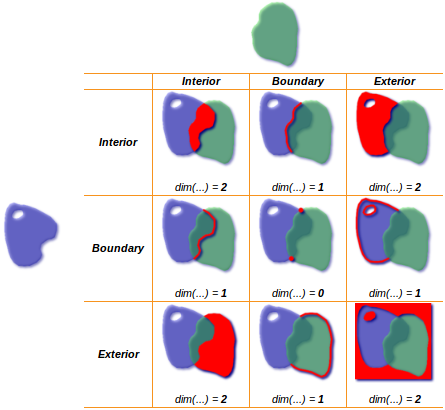
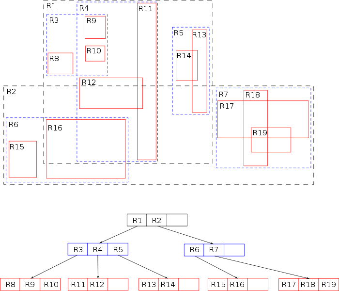
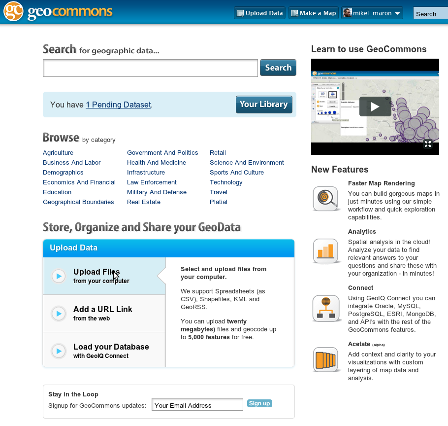
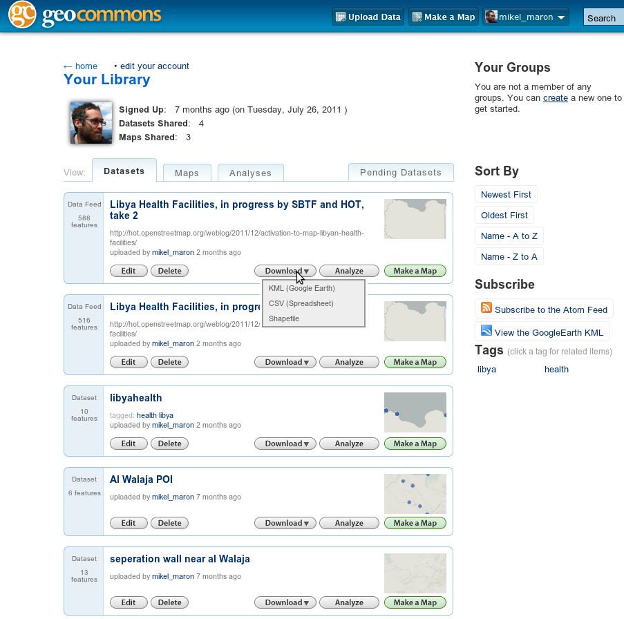
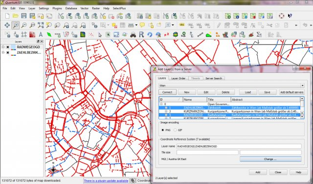

#Cartonama

---
#Introduction

* format: lecture and discussion
* slides: introduction and overview
* software: need list of all software
* data: none
* other: none
* time: 30 minutes
* questions: 
    * the goal ... alcohol shops map app? other ideas: bus stops
    * introduction to GIS and GeoData. familiar with GMapsAPI, but nothing more.
    * what are limits to google maps

---
#Approximately Four Half Days
##Creating Geo Data
##Working with Geo Data
##Visualizing Geo Data
##Building Apps with Geo Data

Goal: an location based app!

---
#Resources
## Github repo of the slides and some materials
https://github.com/mikelmaron/Cartonama
## The LiveBoot ISO
http://aeneous.coolwrks.com/sajjad/Cartonama-Workshop-Hasgeek.iso
## Workshop Schedule
http://workshop.cartonama.org/
## Mailing List
http://groups.google.com/group/cartonama-workshop

---
#CREATING GEO DATA

---
#Introduction to OpenStreetMap
Came away with a solid base understanding of what OpenStreetMap is all about ... the motivations and the approach.

* format: lecture
* slides: basic OSM intro
* software:
* data:
* other:
* time: 30 minutes
* questions:
    * license

---
#OpenStreetMap
##Collaborative Global Mapping, "like Wikipedia for Maps"

---
#what is OpenStreetMap?
##the openstreetmap "one-liner"

---

---
#Bangalore Animation
http://www.youtube.com/watch?v=fpHKb-SZRh8

---
#Haiti

.notes: source http://news.bbc.co.uk/2/hi/uk_news/magazine/8517057.stm

---
#Before / After in OSM

---
#Destroyed buildings, IDP camps

---
#Uses
##Immediate recovery, ongoing reconstruction

---
#Map Kibera

.notes: sourc http://gallery.me.com/dbullington#100816&view=null&bgcolor=black&sel=12

---
#Kibera was a blank spot
##250,000 people, 2.5 km2

---
#The Mappers

---
#The Map!

---
#Voice of Kibera
##Hyper local, geotagged reporting, using Ushahidi

http://voiceofkibera.org/

---
#What distinguishes OSM?
##Open License
##Technical Freedom
##Community

---

---

---

---

---

---

---

---

---

---

---

---

---

---

---

---

---
#Foursquare

http://blog.foursquare.com/2012/02/29/foursquare-is-joining-the-openstreetmap-movement-say-hi-to-pretty-new-maps/

---

---
#GPS Surveying for OSM
Understand how to use a GPS and collect data for OSM

* format: workshop
* slides:
* software:
* data:
* other: GPS units. Maybe Apps?
* time: 1 hour
* questions: 
    * theory and practice
    * mobile: periodicity and accuracy. but what to use ... Android: MyTracks, others. OSMAnd --- unusable. what do they use in jbad? 
    * POIs are not collected nearby to CIS ... street hawkers
    * MyTracks: can adjust frequency. gpx visible as mounted drives. uses GMaps as a basemap

---

---

---

---

---
#Einstein's Theory of Relativity and You!

---

---

---

---

---

---

---

---
Using the GPS

* Turn on GPS
* Get a Signal
* Page to Map
* Zoom and Pan
* Record WayPoints by pushing joy stick straight in
* Note Waypoint number

---
Record Data

* Type of highway and names
* Any interesting POI
* Parking
* Street Direction (one way street)‏
* Land use
* Walking paths, Cycleways, other routes
* Specific Buildings and Amenities
* Crossings, bridges, and tunnels
* Additional Noteworthy Places and Landmarks

---
* Tracks are recorded automatically
    * The track is a guideline, not the map!
* Can use pen/paper, camera, dictaphone, mobile, etc
* Work together to divide up the Cake!

---
#Let's Go

---
#Downloading from GPS
Use of GPSBabel to download GPS data

* format: workshop
* slides: just show the commands
* software: gpsbabel, drivers
* data: results in GPX
* other:
* time: 20 minutes

---
# Download data

* Connect GPS with USB cable

    !sh
    sudo gpsbabel -i Garmin -f usb: -o gpx -F waypoints.gpx
     
---
# Tracks

* Change to USB Mode ... shows up as a drive
* or add -t to gpsbabel command

---
# Putting Maps on GPS

* http://mapas.alternativaslibres.es/downloads.php
* mkgmap

---
#Editing Data in OSM
Facility with JOSM and Potlatch editors.

* format: workshop
* slides: maybe some JOSM screenshots
* software: JOSM. Potlatch?
* data: results in OSM
* other:
* time: 40 minutes
* questions:

---
#JOSM

---
#Tagging, OSM data model and API
Understand Tagging, Map Features, Editing Presets in JOSM and Potlatch

* format: lecture
* slides: needed
* software:
* data:
* other:
* time: 30 minutes
* questions: how to generate interest

---

---

---

http://wiki.openstreetmap.org/wiki/Map_Features

---
#Local Names

    highway = bus_stop
    name = Domlur
    name:en = Domlur
    name:kn = ಡೊಮಲೂರು
    
http://www.openstreetmap.org/browse/changeset/10839653

---
#RESTful API
* simple data format
* tagging for metadata
* standard map tiles
* full planet dumps
= thriving ecosystem of tools, renderers, editors, routers, applications

http://wiki.openstreetmap.org/wiki/APIs

* Main editing API. GET/PUT/DELETE/POST
* XAPI and Overpass GET
* Planet and minutely diffs XML files

---
#Example request

GET http://api.openstreetmap.org/api/0.6/way/35

    !xml
    
    <osm version="0.6" generator="OpenStreetMap server">
    <way id="35" visible="true" timestamp="2010-12-06T14:41:05Z" 
        version="5" changeset="6564105" user="blackadder" uid="735">
    <nd ref="200542"/>
    <nd ref="274057218"/>
    <nd ref="1024965354"/>
    <nd ref="200550"/>
    <nd ref="1024940305"/>
    <nd ref="1024940306"/>
    <nd ref="1024940307"/>
    <nd ref="200551"/>
    <nd ref="200553"/>
    <tag k="highway" v="footway"/>
    <tag k="is_in" v="Sutton Coldfield"/>
    <tag k="note" v="Fire Access Route"/>
    <tag k="surface" v="paved"/>
    </way>
    </osm>

---
#Presets

    !xml
    <presets>
    <group name="Health Service">

    <item name="Basics">
    <label text="Health Service" />

    <text key="name" text="Service Name" />
    <combo key="opening_hours" text="Opening Hours" values="24/7,Mo-Fr 08:30-20:00,Tu-Su 08:00-15:00; Sa 08:00-12:00" 
        default="" delete_if_empty="true" link="http://wiki.openstreetmap.org/wiki/Key:opening_hours" />

    <label text=" " />
    <text key="contact:phone" text="Mobile" 
        link="http://wiki.openstreetmap.org/wiki/Key:contact" />
    <text key="contact:email" text="Email" 
        link="http:///wiki.openstreetmap.org/wiki/Key:contact" />
    </group>
    </presets>
    

http://josm.openstreetmap.de/wiki/TaggingPresets

---

http://wiki.openstreetmap.org/wiki/Develop

---
#Resources
* Basics: http://learnosm.org/
* Using OSM: http://switch2osm.org/
* Book: http://www.openstreetmap.info/
* Wiki: http://wiki.openstreetmap.org/
* Lists, IRC

---
#Results

OSM bus stop data for Bangalore

http://open.mapquestapi.com/xapi/api/0.6/node[highway=bus_stop][bbox=77.4256,12.8254,77.7844,13.1396]

https://github.com/mikelmaron/Cartonama/blob/master/data/busstops-bangalore.xml

---
#WORKING WITH GEO DATA
---
#or, "Points and Lines and Polygons, oh my!"
---
#A Round World
* Not perfectly round
* Not even regularly irregular
* An "oblate spheroid"
* _spheroid_ versus  _geoid_
* _geodesy_
---
#Spheroids

* semi-major axis (equatorial)
* semi-minor axis (polar)
* common spheroids
    * World Geodetic Survey 1984 (WGS84)
    * WGS 1972
    * Everest 1830 and 1956
    * NAD 1927 and 1983
---
#Coordinate Systems

* Geographic:  _latitude_ and _longitude_ in _degrees_
* Projected: _easting_ and _northing_ in _meters_
* False easting and northing
* Datum: coordinate system origin
* WHEN IN DOUBT, USE THE WGS84 SPHEROID AND DATUM
---
#Projections

* Round(ish) world, flat map
* Project on the surface of another solid in some orientation, then unwrap
* Sacrifice shape, area, and/or direction
* Allows us to use Cartesian coordinates (whew!)
---

---
# Cylindrical projections

---
# Transverse cylindrical projections

---
# Conic projections

---
# Plane projections

## Azimuthal

## Orthographic

---
#Projections worth knowing

* Unprojected, or Equirectangular
* Mercator
* Universal Transverse Mercator (UTM)
* Spherical or "Web" Mercator
---
#Equirectangular "Projection"

---
#Mercator

---
#Transverse Mercator

---
#Universal Transverse Mercator (UTM)

---
#Web Mercator

* Originally implemented by Google
* Now standard across web mapping services
* By setting max lat to +/- 85.0511&deg;, the world becomes square
* This has implications for tiling
---
#Spatial Reference Systems

* __Projection + Spheroid + Datum + Units = SRS__
* Also known as "coordinate reference systems" (CRS)

----
#EPSG Codes

* European Petroleum Standards Group
* Established _EPSG codes_ for common spatial reference systems
* Unprojected Longitude/Latitude: __EPSG 4326__
* Web Mercator: __EPSG 3857__
* UTM zone 43 North: EPSG 32643 (for example)

---
#Geographic Data Models

# Raster Data
# Vector Data

_"Raster is faster but vector is correcter."_

---
#Raster Data

* Grid: *columns* x *rows*
* Cell values
    * Discrete
    * Continuous
    * Imagery
* Georeferencing via affine transformation
---
#Affine Transformation

---
#Affine Transformations

---
#World File

    32.0
    0.0
    0.0
    -32.0
    691200.0
    4576000.0

* A: x component of the pixel width (x-scale)
* D: y component of the pixel width (y-skew)
* B: x component of the pixel height (x-skew)
* E: y component of the pixel height (*negative* y-scale)
* C: x-coordinate of the center of the upper left pixel
* F: y-coordinate of the center of the upper left pixel

(example borrowed from Wikipedia)

---
#Raster Formats

* GeoTIFF (.tif)
    * World file (.wld, or .tfw)
    * Projection in "Well-Known Text" (.prj)
* World files for JPEGs, or PNGs (.jpw, .pgw)
* Others: BIL, JPEG2000, ECW, NITF, etc.

---
#Vector Data
* The "Simple Features" Model
* Feature
    * Attributes
    * Geometry
---
#Geometry Types

* Point
* Line
* Polygon
* *Multi*-geometries
---
#Points

* *x* and *y* (and sometimes *z*)
* don't forget, *longitude* is *x* and *latitude* is *y*
* `POINT(77.58 12.96)`
---
#Lines

* Just a sequence of Points
* `LINESTRING(77.56 12.95, 77.57 12.95, 77.58 12.96)`
---
#Polygons

* One or more closed *rings*
* A *ring* is a linestring that intersects *only* at the first and last points
* &#8756; a square is represented with *five* points
* `POLYGON((0 0, 0 1, 1 1, 1 0, 0 0))`
---
#Donut Holes

* Polygons have one *exterior* ring and zero or more *interior* rings
* Interior rings are donut holes
* `POLYGON((0 0, 0 4, 4 4, 4 0, 0 0), (3 3, 3 1, 1 1, 1 3, 3 3))`
---
#Winding Rule

* Donut holes can have holes of their own
* Rings that mark included areas are *clockwise*
* Ring that mark donut holes are *anti-clockwise*
* This is to make area calculations work right

---
#Vector Formats

* ESRI Shapefile
* GML
* KML
* GeoJSON
* "Well-Known" Text (WKT) and Binary (WKB)
* GeoRSS
* GPX
---
#The misnamed "Shapefile"

* __.shp__
* __.shx__
* __.dbf__
* .prj
* others (e.g. .sbn, .xml, etc.)
---
#GeoJSON

http://geojson.org/

    { "type": "Point", "coordinates": [77.58, 12.96] }

---
#GeoJSON LineString

    {
        "type": "LineString",
        "coordinates": [ [100.0, 0.0], [101.0, 1.0] ]
    }

---
#GeoJSON Polygon

    {
        "type": "Polygon",
        "coordinates": [
            [ [100.0, 0.0], [101.0, 0.0], [101.0, 1.0], [100.0, 1.0], [100.0, 0.0] ]
        ]
    }

---
#GeoJSON Donut Holes

    { 
        "type": "Polygon",
        "coordinates": [
            [ [100.0, 0.0], [101.0, 0.0], [101.0, 1.0], [100.0, 1.0], [100.0, 0.0] ],
            [ [100.2, 0.2], [100.8, 0.2], [100.8, 0.8], [100.2, 0.8], [100.2, 0.2] ]
        ]
    }

---
#GeoJSON Feature

    { 
        "type": "Feature",
        "geometry": {"type": "Point", "coordinates": [77.58, 12.96]},
        "properties": {"name": "Bangalore"}
    }

_N.B._ Properties can be any legit JSON object!

---
#GeoJSON FeatureCollection

    {
        "type": "FeatureCollection",
        "features": [ ... ]
    }

---
#GEO ENABLED DATABASES
---
#PostGIS

* A geospatial extension to PostgreSQL
* Geometry operations
* Spatial predicates
* Spatial indexes
* Spatial reference system support

---
#Create a PostGIS template database

##Create a PostGIS template

    $ createdb template_gis
    $ createlang plpgsql template_gis
    $ psql template_gis </usr/share/postgis/postgis.sql
    $ psql template_gis </usr/share/postgis/spatial_ref_sys.sql

##Make a spatial database from the template

    $ createdb -Ttemplate_gis my_new_postgis_db

---
#PostGIS metadata tables

## geometry_columns
 
          Column       |          Type          | Modifiers 
    -------------------+------------------------+-----------
     f_table_catalog   | character varying(256) | not null
     f_table_schema    | character varying(256) | not null
     f_table_name      | character varying(256) | not null
     f_geometry_column | character varying(256) | not null
     coord_dimension   | integer                | not null
     srid              | integer                | not null
     type              | character varying(30)  | not null

## spatial_ref_sys

      Column   |          Type           | Modifiers 
    -----------+-------------------------+-----------
     srid      | integer                 | not null
     auth_name | character varying(256)  | 
     auth_srid | integer                 | 
     srtext    | character varying(2048) | 
     proj4text | character varying(2048) | 

---
#Create a PostGIS table

## Create the table

    CREATE TABLE poi (id SERIAL, name VARCHAR);

## Add the geometry column

    SELECT AddGeometryColumn('poi','location',4326,'POINT',2);

---
#Create a PostGIS table

    # \d poi
                       Table "public.poi"

      Column  |       Type        |         Modifiers
    ----------+-------------------+--------------------------------------
     id       | integer           | not null default nextval(...)
     name     | character varying | 
     location | geometry          | 

    Check constraints:
        "enforce_dims_location" CHECK (st_ndims(location) = 2)
        "enforce_geotype_location" CHECK
            (geometrytype(location) = 'POINT'::text OR location IS NULL)
        "enforce_srid_location" CHECK (st_srid(location) = 4326)  

---
#Create some spatial data

    # INSERT INTO poi (name, location)
             VALUES ('CIS', 'POINT(77.6375384 12.9647134)');

    ERROR:  new row for relation "poi" violates check constraint
            "enforce_srid_location"

    # INSERT INTO poi (name, location)
             VALUES ('CIS', 'SRID=4326;POINT(77.6375384 12.9647134)');

    INSERT 0 1

---
#Select some spatial data

    # SELECT * FROM poi;

     id | name |                      location                      
    ----+------+----------------------------------------------------
      2 | CIS  | 0101000020E61000006D7CDC6DCD685340A4062EEAEEED2940
    (1 row)

    # SELECT id, name, AsText(location) FROM poi;

     id | name |            astext            
    ----+------+------------------------------
      2 | CIS  | POINT(77.6375384 12.9647134)
    (1 row)

---
#Spatial predicates

* Equals
* Is Disjoint With
* Intersects
* Touches
* Crosses
* Is Within
* Contains
* Overlaps
* Covers
* Is Covered By

---
#DE-9IM
"Dimensionally Extended 9 Intersection Model" (DE-9IM)

---
#PostGIS spatial predicates

* ST\_Equals(geom1, geom2)
* ST\_Disjoint(geom1, geom2)
* ST\_Intersects(geom1, geom2)
* ST\_Touches(geom1, geom2)
* ST\_Crosses(geom1, geom2)
* ST\_Within(geom1, geom2)
* ST\_Contains(geom1, geom2)
* ST\_Overlaps(geom1, geom2)
* ST\_Covers(geom1, geom2)
* ST\_CoveredBy(geom1, geom2)

---
#Load data from Shapefile

    $ shp2pgsql -s4326 -I world_borders.shp admin0 | psql my_db

                   Table "public.world_borders"
       Column   |         Type          |   Modifiers                          
    ------------+-----------------------+------------------------------
     gid        | integer               | not null default nextval(...)
     cat        | double precision      | 
     fips_cntry | character varying(80) | 
     cntry_name | character varying(80) | 
     area       | double precision      | 
     pop_cntry  | double precision      | 
     the_geom   | geometry              | 

    Indexes:
        "world_borders_pkey" PRIMARY KEY, btree (gid)
        "world_borders_the_geom_gist" gist (the_geom)
    Check constraints:
        "enforce_dims_the_geom" CHECK (st_ndims(the_geom) = 2)
        "enforce_geotype_the_geom" CHECK
            (geometrytype(the_geom) = 'MULTIPOLYGON'::text ...)
        "enforce_srid_the_geom" CHECK (st_srid(the_geom) = 4326)

---
#Apply a spatial predicate

    # SELECT name, cntry_name FROM world_borders, poi
        WHERE st_contains(world_borders.the_geom, poi.location);

     name | cntry_name 
    ------+------------
     CIS  | India
    (1 row)

---
#Geometry processing

* ST\_Union(geom1, geom2)
* ST\_Intersection(geom1, geom2)
* ST\_Difference(geom1, geom2)
* ST\_Buffer(geom, distance)
* ST\_ConvexHull(geom)
* ST\_Transform(geom, srid)
* ... and many more!

---
#Geometry measurement

* ST\_Distance(geom1, geom2)
* ST\_Length(geom)
* ST\_Area(geom)
* ST\_Centroid(geom)
* ST\_Distance\_Spheroid(geom1, geom2)
* ... and many more!

---
#Area example

    SELECT SUM(ST_Area(ST_Transform(the_geom, 32643))) / 1000000
        FROM world_borders WHERE cntry_name = 'India';

    ?column?     
    ------------------
    3196343.52393187
    (1 row)

---
#Spheroid distance example

    
    SELECT ST_Distance_Sphere(
            'POINT(77.6375384 12.9647134)', 'POINT(122.7 37.4)') / 1000;

    ?column?     
    ------------------
    5216.69910277434
    (1 row)

---
#Spatial indexes?

    # EXPLAIN SELECT name, cntry_name FROM world_borders, poi
              WHERE st_contains(world_borders.the_geom, poi.location);

                             QUERY PLAN
    ----------------------------------------------------------------------
     Nested Loop  (cost=0.00..1347.15 rows=1 width=14)
       Join Filter: ((world_borders.the_geom && poi.location) AND
                     _st_contains(world_borders.the_geom, poi.location))
       ->  Seq Scan on poi  (cost=0.00..1.01 rows=1 width=104)
       ->  Seq Scan on world_borders
                        (cost=0.00..352.84 rows=3784 width=6982)
    (4 rows)

---
#Create a spatial index

    # CREATE INDEX world_borders_the_geom_gist
             ON world_borders USING GIST (the_geom);

    # EXPLAIN SELECT name, cntry_name FROM world_borders, poi
              WHERE st_contains(world_borders.the_geom, poi.location);

                             QUERY PLAN
    ----------------------------------------------------------------------
     Nested Loop  (cost=0.00..1815.00 rows=5 width=42)
       Join Filter: _st_contains(world_borders.the_geom, poi.location)
       ->  Seq Scan on poi  (cost=0.00..18.30 rows=830 width=64)
       ->  Index Scan using world_borders_the_geom_gist on world_borders
            (cost=0.00..1.90 rows=1 width=6982) 
             Index Cond: (the_geom && poi.location)
    (6 rows)

---
#R-trees

---
#Dump a spatial table to a Shapefile

    $ pgsql2shp my_db poi

    Initializing... Done (postgis major version: 1).
    Output shape: Point
    Dumping: XX [1 rows].

---
#Data Swiss Army Knives
---
#GDAL/OGR

A F/OSS library that speaks dozens and dozens of formats

* GDAL is for raster data
* OGR is for vector data
---
#Exploring rasters

    $ gdalinfo SRTM_fB03_n012e077.tif 

    Driver: GTiff/GeoTIFF
    Files: SRTM_fB03_n012e077.tif
    Size is 1201, 1201
    Coordinate System is:
    GEOGCS["WGS 84",
        DATUM["WGS_1984",
            SPHEROID["WGS 84",6378137,298.257223563,
                AUTHORITY["EPSG","7030"]],
            AUTHORITY["EPSG","6326"]],
        PRIMEM["Greenwich",0],
        UNIT["degree",0.0174532925199433],
        AUTHORITY["EPSG","4326"]]
    Origin = (76.999583333333334,13.000416666666666)
    Pixel Size = (0.000833333333333,-0.000833333333333)
    Corner Coordinates:
    Upper Left  (  76.9995833,  13.0004167) ( 76d59'58.50"E, 13d 0' 1.50"N)
    Lower Left  (  76.9995833,  11.9995833) ( 76d59'58.50"E, 11d59'58.50"N)
    Upper Right (  78.0004167,  13.0004167) ( 78d 0' 1.50"E, 13d 0' 1.50"N)
    Lower Right (  78.0004167,  11.9995833) ( 78d 0' 1.50"E, 11d59'58.50"N)
    Center      (  77.5000000,  12.5000000) ( 77d30' 0.00"E, 12d30' 0.00"N)
    Band 1 Block=1201x1 Type=Float32, ColorInterp=Gray

---
#Transforming rasters

##gdal\_translate

    $ gdal_translate -of GTiff some_other_format.jpg a_better_format.tif

    $ gdal_translate --formats

##gdalwarp

    $ gdalwarp -t_srs EPSG:3875 some_file_in_4326.tif web_mercator.tif

##gdaladdo

    $ gdaladdo satellite_image.tif 2 4 8 16 32

---
#Exploring vectors
    $ ogrinfo world_borders.shp

    INFO: Open of `world_borders.shp'
          using driver `ESRI Shapefile' successful.
    1: world_borders (Polygon)
---
#Exploring vectors
    $ ogrinfo world_borders.shp

    Layer name: world_borders
    Geometry: Polygon
    Feature Count: 3784
    Extent: (-180.000000, -90.000000) - (180.000000, 83.623596)
    Layer SRS WKT:
    (unknown)
    CAT: Real (16.0)
    FIPS_CNTRY: String (80.0)
    CNTRY_NAME: String (80.0)
    AREA: Real (15.2)
    POP_CNTRY: Real (15.2)

    OGRFeature(world_borders):0
      CAT (Real) =                1
      FIPS_CNTRY (String) = AA
      CNTRY_NAME (String) = Aruba
      AREA (Real) =          193.00
      POP_CNTRY (Real) =        71218.00
      POLYGON ((-69.882233 12.41111,-69.946945 12.436666, ...))
---
#Transforming vectors

## Assigning SRS

    $ ogr2ogr -a_srs epsg:4326 world_borders_4326.shp world_borders.shp

## Transforming SRS
    
    $ ogr2ogr -a_srs epsg:4326 -t_srs epsg:3875 world_borders_3875.shp world_borders.shp

## Format conversion

    $ ogr2ogr -f KML world_borders.kml world_borders.shp 

## Database support

    $ ogr2ogr -f PostgreSQL PG:dbname=my_db world_borders.kml
---

#GeoCommons

---

#GeoCommons

---

#Quantum GIS (QGIS)

---
#Processing OSM Data
---
#OSM API

* API

    $ curl http://api.openstreetmap.org/api/0.6/map?bbox=-0.5,51.25,0.5,51.75 

    (only returns 50,000 objects)

* XAPI
    * Fewer limits
    * Allows filtering by tags
    * Dog slow

---
#OSM dumps

* Formats
    * XML
    * Protocol Buffers (PBF)

* Planet.osm
    * http://planet.openstreetmap.org/
    * Full size: 20GB *compressed*
    * Weekly changesets: 400MB
    * Hourly and minutely changes
---
#OSM dumps

* Planet Extracts
    * http://download.geofabrik.de/
    * http://download.cloudmade.com/
    * http://metro.teczno.com/
    
---
#osm2pgsql

## Lat/Lon import

    $ osm2pgsql -l -d my_db -s -G planet.osm.bz2

## Mercator import

    $ osm2pgsql -m -d my_db -s -G planet.osm.bz2

## Partial import
    
    $ osm2pgsql -l -d my_db -b -0.5,51.25,0.5,51.75 planet.extract.osm.bz2

## Important flags

* -l / -m = 4326 vs 3875
* -s = "slim mode"
* -G = compute multi-geometries
* -b minlon,minlat,maxlon,maxlat = geographic extract
---
#osm2pgsql styles

* "Style" dictates which tags get turned into columns
* Default lives in `/usr/share/osm2pgsql/default.style` or similar

        # OsmType  Tag          DataType     Flags
        node,way   note         text         delete
        node,way   source       text         delete
        node,way   created_by   text         delete
        node,way   access       text         linear
        node,way   admin_level  text         linear
        node,way   aerialway    text         linear
        node,way   aeroway      text         polygon
        ...

---
#osm2pgsql schema

* planet_osm_line: contains all imported ways
* planet_osm_point: contains all imported nodes with tags
* planet_osm_polygon: contains all imported polygons
* planet_osm_roads: contains just the roads

---
#Osmosis

http://wiki.openstreetmap.org/wiki/Osmosis

## Create a local API database

    osmosis --read-xml file="planet.osm" --write-apidb database="x"

## Apply a diff to an OSM file

    osmosis --read-xml-change file="planetdiff-1-2.osc"
            --read-xml file="planet1.osm"
            --apply-change --write-xml file="planet2.osm"

## Extract specific key value pairs

    osmosis --read-xml city.osm 
            --way-key-value keyValueList="railway.tram,railway.tram_stop"
            --used-node --write-xml city_tram.osm

## Extract a bounding box

    bzcat downloaded.osm.bz2 | osmosis\
        --read-xml enableDateParsing=no file=-\
        --bounding-box top=49.5138 left=10.9351 bottom=49.3866 right=11.201
        --write-xml file=-\
       | bzip2 > extracted.osm.bz2

---
#osmium

http://wiki.openstreetmap.org/wiki/Osmium

    /*
      run with: osmjs -l sparsetable -j extract-nodes.js OSMFILE
    */

    wanted_keys = [ ... ];

    Osmium.Callbacks.node = function() {
      if(!this.tags["name"] && !this.tags["place_name"]) return;
      found_wanted_keys = false;
      for (var i = 0; i < wanted_keys.length; i++) {
        if (this.tags[wanted_keys[i]]) {
            found_wanted_keys = true;
            break;
        }
      }
      if (!found_wanted_keys) return;
      print(JSON.stringify({
        "geom": [this.geom.lon, this.geom.lat],
        "tags": this.tags, 
        "type":"node", 
        "id": this.id
        })
      )
    }

---
#Shapefile export via osmjs

    var shp_pois = Osmium.Output.Shapefile.open('./pois', 'point');
    shp_pois.add_field('id', 'integer', 10);
    shp_pois.add_field('type', 'string', 32);
    shp_pois.add_field('name', 'string', 32);

    var node_tags = {
        amenity: { restaurant: 'restaurant', pub: 'pub' },
        shop: { supermarket: 'supermarket' }
    }

(continued...)

---
#Shapefile export via osmjs, part 2

    Osmium.Callbacks.node = function() {
        for (var key in this.tags) {
            if (node_tags[key]) {
                var type = node_tags[key][this.tags[key]];
                if (type) {
                    shp_pois.add(this.geom, {
                        id: this.id,
                        type: type, 
                        name: this.tags.name
                    });
                }
            }
        }
    }

    Osmium.Callbacks.end = function() {
        shp_pois.close();
    }

---
END OF DAY 1
---
TIRED YET?
---
#Results

https://github.com/mikelmaron/Cartonama/blob/master/data/bangalore-bus-shp.zip

---
#VISUALIZING GEO DATA

---
#Tiles
What are Map Tiles?

* format: lecture
* slides: what are tiles about
* software:
* data:
* other:
* time: 15 minutes
* questions: more interest in this
** nice graphics needed for tile pyramid 

---
#TileMill
Creating Tiles w/ TileMill

* format: tutorial
* slides: adding data, carto, mapbox
* software: tilemill
* data: Shapefiles and/or PostGIS. result in tiles.
* other:
* time: 1.5 hours
* questions: what can we get from devseed
** show how to generate\_tiles.py from mapnik style sheets output by tilemill
 * connect to shapefile, postgis db
 * overlay on preset osm tiles. render osm data itself
 * render raster data as well

---
#Multi-lingual Tiles

* format: tutorial?
* slides: 
* software:
* data: need to make sure data collected and processed into shapefile includes translations
* other:
* time: 30 minutes
* questions: really try to show this, though it might be tricky

---
#Carto references localized name

    @futura_med: "Kedage Normal", "Futura Medium","Function Pro Medium","Ubuntu Regular","Trebuchet MS Regular","DejaVu Sans Book","unifont Medium";

    #bus_stops {
      marker-width: 2;
      marker-line-color: #00f;
      text-fill: #b50d38;
      text-name: "[name_kn]";
      text-face-name: @futura_med;
      text-size: 12;
      text-dx: 5;
      text-allow-overlap: false;  
    }

https://tiles.mapbox.com/groundtruth/map/map-busd5lm5

---
#Serving Tiles
Ways to serve tiles ... TileCache (for imagery), TileStash, MapBox, mod_tile, etc

* format: lecture
* slides: show the various ways and how to configure
* software:
* data:
* other:
* time: 30 minutes
* questions: hands on or?

---
#Results

https://tiles.mapbox.com/groundtruth/map/map-busd5lm5

---
#BUILDING APPS WITH GEO DATA

---
#Javascript Mapping APIs
survey Javascript Mapping APIs (OpenLayers, ModestMaps, GMaps API, Leaflet, Mapstraction)

* more interest in this
* format: lecture
* slides:
* software:
* data:
* other:
* time: 30 minutes
* questions: survey the options, and pick one

leaflet and discussion
---
#Geocoding and Location Queries

* format: workshop
* slides: basic geocoding apis. and a basic location query proxy?
* software:
* data:
* other:
* time: 45 minutes
* questions: more interest in this. is there a small postgis->geojson web service? maybe flask, or node.js. python would have postgis bindings

show nominatim, geonames, overpass api

---
#Putting it all Together
Create an app using, tiles and search, generated from the collected data.

* format: workshop
* slides: instructions
* software: html, css, js.
* data: tiles, database. this results in the app.
* other:
* time: 1.5 hours
* questions: would be nice to have this app built.

https://github.com/yuvipanda/POSM
http://yuvi.in/POSM/

---
#SUGGESTIONS

---
#Managing Map Data in MySQL or Postgres

* there is a session on this in "Working"

---
#Routing fundamentals

* could simply be a lecture during part 4.

---
#How to pick a mapping service

* part of Javascript Mapping APIs, or earlier during OSM?

---
#Building mobile location based apps

* http://phonegap.com/ ? part of part 4 extra credit?
* https://github.com/yuvipanda/POIOSM

---
#Maps and Frameworks?

* Django, Drupal, Rails
