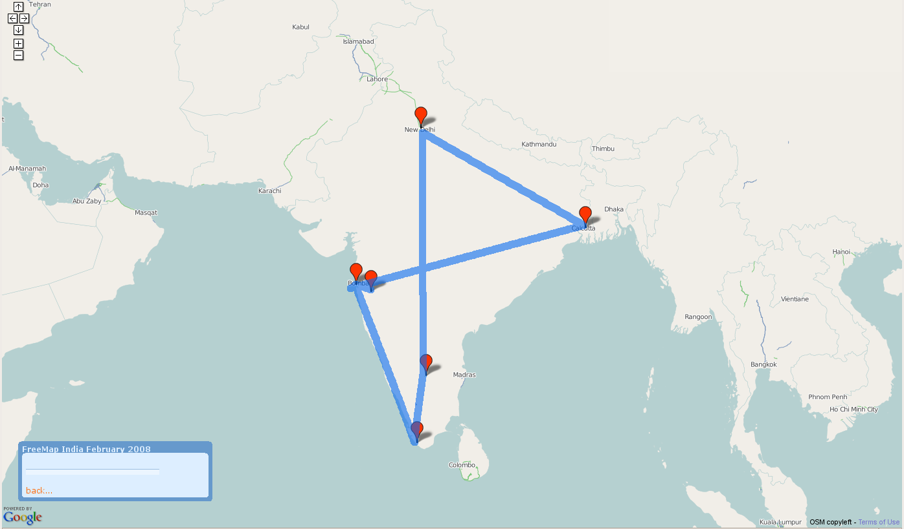

#Cartonama

* look through the half days and the sessions
* does it all flow together comprehensively?
* does it actually work? what needs implementation?
* what's missing? what's unnecessary?
* what resources do we need? what needs to be prepared?

trying to determine for each session

* format:
* slides: 
* software: 
* data:
* other: 
* time: 
* questions: 

https://github.com/mikelmaron/Cartonama

http://aeneous.coolwrks.com/sajjad/Cartonama-Workshop-Hasgeek.iso

https://docs.google.com/spreadsheet/pub?key=0AkAxbDR2ycpddExzQ3JoV0pzT0t5aVFDSEFtSzdrNVE&single=true&gid=9&output=html

---
#Four half days
##Creating Geo Data
##Working with Geo Data
##Visualizing Geo Data
##Building Apps with Geo Data

---
#Introduction

* format: lecture and discussion
* slides: introduction and overview
* software: need list of all software
* data: none
* other: none
* time: 30 minutes
* questions: the goal ... alcohol shops map app? other ideas: bus stops
** introduction to GIS and GeoData. familiar with GMapsAPI, but nothing more.
** what are limits to google maps

---

---
#CREATING GEO DATA

---
#Introduction to OpenStreetMap
Came away with a solid base understanding of what OpenStreetMap is all about ... the motivations and the approach.

* format: lecture
* slides: basic OSM intro
* software:
* data:
* other:
* time: 30 minutes
* questions:
** license

---
#OpenStreetMap
##Collaborative Global Mapping, "like Wikipedia for Maps"

---
#what is OpenStreetMap?
##the openstreetmap "one-liner"

---

---
#Haiti

.notes: source http://news.bbc.co.uk/2/hi/uk_news/magazine/8517057.stm

---
#Before / After in OSM

---

---
#Uses
##Immediate recovery, ongoing reconstruction

---
#Map Kibera

.notes: sourc http://gallery.me.com/dbullington#100816&view=null&bgcolor=black&sel=12

---
#Kibera was a blank spot
##250,000 people, 2.5 km2

---
#The Mappers

---
#The Map!

---
#Voice of Kibera
##Hyper local, geotagged reporting, using Ushahidi

http://voiceofkibera.org/

---
#What distinguishes OSM?
##Open License
##Technical Freedom
##Community

---

---

---

---

---

---

---

---

---

---

---

---

---

---

---

---
#Foursquare

http://blog.foursquare.com/2012/02/29/foursquare-is-joining-the-openstreetmap-movement-say-hi-to-pretty-new-maps/

---

---
#GPS Surveying for OSM
Understand how to use a GPS and collect data for OSM

* format: workshop
* slides:
* software:
* data:
* other: GPS units. Maybe Apps?
* time: 1 hour
* questions: less interest (at least from funnel so far)
** theory and practice
** updated from swaziland
** mobile: periodicity and accuracy. but what to use ... Android: MyTracks, others. OSMAnd --- unusable. what do they use in jbad? 
** POIs are not collected nearby to CIS ... street hawkers
** MyTracks: can adjust frequency. gpx visible as mounted drives. uses GMaps as a basemap
** Watch the time!!!

---

---

---

---

---

---
#Downloading from GPS
Use of GPSBabel to download GPS data

* format: workshop
* slides: just show the commands
* software: gpsbabel, drivers
* data: results in GPX
* other:
* time: 20 minutes

---
#Editing Data in OSM
Facility with JOSM and Potlatch editors.

* format: workshop
* slides: maybe some JOSM screenshots
* software: JOSM. Potlatch?
* data: results in OSM
* other:
* time: 40 minutes
* questions:

---
#Tagging and Map Features, OSM data model and API
Understand Tagging, Map Features, Editing Presets in JOSM and Potlatch

* format: lecture
* slides: needed
* software:
* data:
* other:
* time: 30 minutes
* questions: how to generate interest

---
#RESTful API
* simple data format
* tagging for metadata
* standard map tiles
= thriving ecosystem of tools, renderers, editors, routers, applications

---

---

---

---

---
#Restful response

Check this code:

  !python
      &lt;way id='7972254' timestamp='2007-09-24T12:36:29+01:00' user='chippy' visible='true'>
    <nd ref='59608510' />
    <nd ref='59608509' />
    <nd ref='59608516' />
    <nd ref='59608515' />
    <nd ref='59608514' />
    <nd ref='59608513' />
    <nd ref='59608512' />
    <nd ref='59608511' />
    <nd ref='59608510' />
    <tag k='created_by' v='JOSM' />
    <tag k='building' v='retail' />
    <tag k='name' v='White Rose Shopping Centre' />
    <tag k='amenity' v='shopping_centre' />
    <tag k='note' v='huge building' />
  </way>

---
testing code:
  why
  doestn't
  this
  work

* total time: 2.5 hours
* data: results in data in OSM ... should have this already created for Bangalore
** Is the enough time??
---
#WORKING WITH GEO DATA

---
#Geo File Formats
Understand the most common ways GeoData is shared: Shapefile, CSV, KML, GeoRSS, GeoJSON

* format: lecture
* slides: yea, formats ... Shapefile, KML, GeoJSON, CSV, GeoRSS, GPX, etc ... with a few tips (shapefile column name limits)
* software:
* data:
* other:
* time: 15 minutes
* questions: how can this not be boring?
** Basic GIS data models ... geometries, features, attributes, rasters. projections.
** demonstrate using QGIS
 * Future of Web Apps Slides http://schuyler.github.com/
---
#Geo Enabled Databases
Understand PostGIS basics and MySQL spatial extension

* format: lecture
* slides: all about OGC Simple Features, their implementation in PostGIS and MySQL. Basics about setting up PostGIS and using spatial columns, etc.
* software:
* data:
* other:
* time: 45 minutes
* questions: should this be more hands on?
** WKT, Spatial Indexes, Predicates, shp2pgsql, pgsql2shp
 * non-relational dbs and spatial search suckage
 * could just show a database
 * spatial meta-data
 * projections

---
#Processing OSM Data & Making Shapefiles
Processing OSM data (osmosis, osmlib. osmium, imposm)

* format: workshop
* slides: download an extract, transform
* software: wget. osm2pgsql. osmium. osmlib. osmjs
* data: OSM data and Shapefiles
* other:
* time: 45 minutes
* questions:

---
#Data Swiss Army Knives
Convert and process geodata w/ OGR, GeoCommons

* format: workshop
* slides: OGR commands
* software: OGR/GDAL, GeoCommons, GPSBabel
* data: Shapefile of stuff
* other:
* time: 20 minutes
* questions: important to know about it

---

* total time: ~2.5 hours
* data: results in data in Shapefile and/or database

---
#VISUALIZING GEO DATA

---
#Tiles
What are Map Tiles?

* format: lecture
* slides: what are tiles about
* software:
* data:
* other:
* time: 15 minutes
* questions: more interest in this
** nice graphics needed for tile pyramid 

---
#TileMill
Creating Tiles w/ TileMill

* format: tutorial
* slides: adding data, carto, mapbox
* software: tilemill
* data: Shapefiles and/or PostGIS. result in tiles.
* other:
* time: 1.5 hours
* questions: what can we get from devseed
** show how to generate_tiles.py from mapnik style sheets output by tilemill
 * connect to shapefile, postgis db
 * overlay on preset osm tiles. render osm data itself
 * render raster data as well

---
#Multi-lingual Tiles

* format: tutorial?
* slides: 
* software:
* data: need to make sure data collected and processed into shapefile includes translations
* other:
* time: 30 minutes
* questions: really try to show this, though it might be tricky

---
#Serving Tiles
Ways to serve tiles ... TileCache (for imagery), TileStash, MapBox, mod_tile, etc

* format: lecture
* slides: show the various ways and how to configure
* software:
* data:
* other:
* time: 30 minutes
* questions: hands on or?

---

* total time: 3 hours
* data: tiles

---
#BUILDING APPS WITH GEO DATA

---
#Javascript Mapping APIs
survey Javascript Mapping APIs (OpenLayers, ModestMaps, GMaps API, Leaflet, Mapstraction)

* more interest in this
* format: lecture
* slides:
* software:
* data:
* other:
* time: 30 minutes
* questions: survey the options, and pick one

---
#Geocoding and Location Queries

* format: workshop
* slides: basic geocoding apis. and a basic location query proxy?
* software:
* data:
* other:
* time: 45 minutes
* questions: more interest in this. is there a small postgis->geojson web service? maybe flask, or node.js. python would have postgis bindings

---
#Putting it all Together
Create an app using, tiles and search, generated from the collected data.

* format: workshop
* slides: instructions
* software: html, css, js.
* data: tiles, database. this results in the app.
* other:
* time: 1.5 hours
* questions: would be nice to have this app built.

https://github.com/yuvipanda/POSM
http://yuvi.in/POSM/

---
#SUGGESTIONS

---
#Managing Map Data in MySQL or Postgres

* there is a session on this in "Working"

---
#Routing fundamentals

* could simply be a lecture during part 4.

---
#How to pick a mapping service

* part of Javascript Mapping APIs, or earlier during OSM?

---
#Building mobile location based apps

* http://phonegap.com/ ? part of part 4 extra credit?
* https://github.com/yuvipanda/POIOSM

---
#Maps and Frameworks?

* Django, Drupal, Rails
